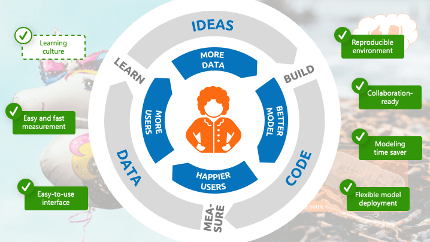
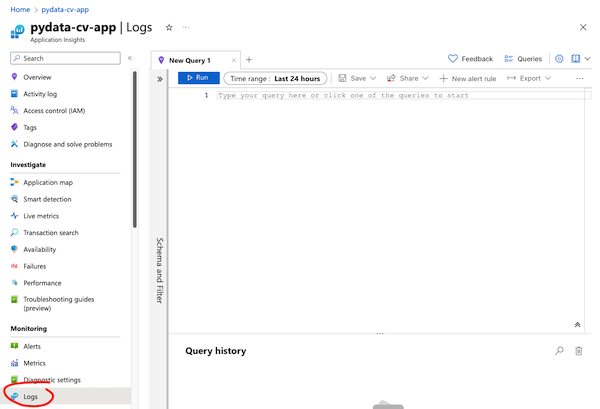
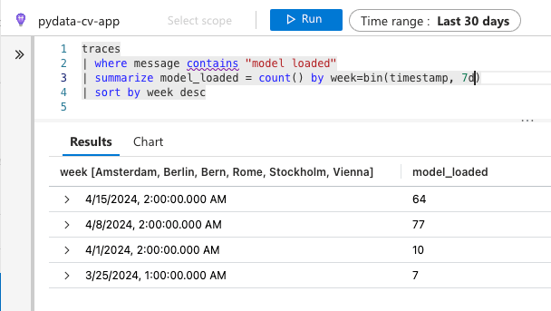

<p align="center">
  
</p>
<p align="center">
  <b>From idea to production in a day:</b><br>
  <b>Leveraging Azure ML and Streamlit to build and user test machine learning ideas quickly</b>
</p>
<p align="center">
  Talk Slides | <a href="#overview">Overview</a> | <a href="#getting-started">Getting Started</a> | <a href="#usage">Usage</a> | <a href="#learn-more">Learn More</a>
</p>

# Overview

This repository contains the code for the talk "From idea to production in a day: Leveraging Azure ML and Streamlit to build and user test machine learning ideas quickly" by [Florian Roscheck](https://www.linkedin.com/in/florianroscheck) at [PyData Berlin 2024](https://2024.pycon.de/).

The repository contains notebooks for ingesting data into Azure Machine Learning and for submitting this data for training with Azure Automated Machine Learning. The trained model is then embedded into a Streamlit app for user testing. The app includes feedback functionality which submits the feedback to the Azure cloud where it can be evaluated via Azure Application Insights and Azure Dashboards. The repository also contains sample Kusto queries for building the dashboards.

# Getting Started

To use this repository, you should have an Azure Machine Learning subscription.

The best way to get started is to train a machine learning model through Azure Automated Machine Learning. To do this, clone this repository in the terminal of an Azure compute instance like so:

```bash
git clone https://github.com/flrs/build_and_test_ml_quickly.git
```

Then, go through the notebooks in the `notebooks` folder in the following order:

1. [`0_prepare_dataset.ipynb`](/notebooks/0_getting_started.ipynb): Download, transform, and register a dataset in the Azure ML workspace.
2. [`1_train_model.ipynb`](/notebooks/1_train_model.ipynb): Train a model using Azure Automated Machine Learning.

Afterwards, read on in the [Usage](#usage) section below to learn about how to integrate the model into an app and start collecting user feedback.

# Usage

As outlined in the talk, the technology stack in this repository can be split into the following phases:

1. [Get Data](#1-get-data)
2. [Train Model](#2-train-model)
3. [Build App](#3-build-app)
4. [Deploy App with Model](#4-deploy-app-with-model)
5. [Collect Feedback](#5-collect-feedback)

This section explains the resources available in this repository for each of these phases and how to use them.

## 1. Get Data

For getting data, please follow the instructions in [`0_prepare_dataset.ipynb`](notebooks/0_prepare_dataset.ipynb). The notebook contains ample explanations to walk you through how to ingest data from the [TACO](http://tacodataset.org/) trash image dataset into Azure Machine Learning. The notebook also focuses on the process of transforming image annotations from COCO format into JSONL format for consumption with Azure Machine Learning. You can find out more about how to run this notebook in the [Getting Started](#getting-started) section.

## 2. Train Model

After getting data and registering it as a data asset in Azure Machine Learning, you can now train a model using Azure Automated Machine Learning. How to do this is documented in the [`1_training.ipynb`](notebooks/1_training.ipynb) notebook. You can run it with the same process as the `0_prepare_dataset.ipynb` notebook (see above).

Once the model training has completed, you should extract the ONNX version of the best model from the Azure Machine Learning platform. You can access it via the web interface of Azure Machine Learning. Here, access the experiment for the best of the models which Azure Automated Machine Learning trained. Then, click on the "Outputs + logs" tab. Here, in the `train_artifacts` directory, you will find the files `model.onnx` and `labels.json`. Download both of these files and paste them in the [`models/trash_recognizer`](models/trash_recognizer) directory.

> When you clone this directory, model files already exist in the `models/trash_recognizer` directory. The model in these files is a default model trained on the TACO image dataset that you can use to get started quickly. Still, if you want to train your own model, follow the instructions outlined above and replace the existing model files.

## 3. Build App

<p align="center">
  
</p>

You can find resources for the [Streamlit](https://streamlit.io/) app in the [`src`](src/) directory. To use the app, you need to install the requirements in [`requirements.txt`](requirements.txt) like so:

```bash
pip install -r requirements.txt
```

There are two versions of the app: A simple and a full version. The [simple version](src/app_simple.py) is a great resource to start with if you are not familiar with streamlit. It will perform slower that the full version and does not include feedback functionality.

The [full version](src/app.py) of the app includes feedback functionality. It also includes performance improvements like caching model predictions. However, these improvements come at the cost of more complex code which might be difficult to understand for people who use Streamlit for the first time.

To run any of the apps on your local machine, execute the command

```bash
streamlit run app.py
```

from inside the `src/` directory in the command line.

Either app uses a suite of pre- and postprocessing tools for images which are explained in the following sections. **The pre- and postprocessing tools included in this repository can speed up your development work with Azure Automated ML models as they circumvent the challenge of building custom pre- and post-processing code.**

### 3.1 Image Preprocessing

The function `preprocess` in [`src/utils/preprocessing.py`](src/utils/preprocessing.py) is important for getting an image ready for inference via the [`src/ml/model.py`](src/ml/model.py) module. `preprocess` adjusts the data type and shape to what the interference mechanism through the `onnxruntime` library expects. The preprocessing code also normalizes the colors in the image, in accordance with [Microsoft's recommendations](https://learn.microsoft.com/en-us/azure/machine-learning/how-to-inference-onnx-automl-image-models?view=azureml-api-2&tabs=instance-segmentation#preprocessing) for getting predictions from the Mask R-CNN model through onnxruntime.

### 3.2 Model Inference

Model inference is handled by the [`src/ml/model.py`](src/ml/model.py) module. Predictions can be made using the `predict` method of the `TrashRecognizerModel` class. The `TrashRecognizer.print_stats()` method offers an easy way to show several metadata about the model in the ONNX file.

### 3.3 Image Postprocessing

The task of postprocessing is to overlay the model predictions (bounding boxes and object outlines) onto the original images for display to the user. This task is taken over by `TrashRecognizer.plot_predictions()` in the [`src/ml/model.py`](src/ml/model.py) module. The functionality leverages modules from the `torchvision` module.

## 4. Deploy App with Model

The right way to deploy the app depends on the environment. For fast deployment, experience has shown that it is a wise idea to reduce the number of interfaces where potential deployment issues can occur. Therefore, deploying the app and including the model into the deployment, in contrast to deploying the model as a separate API from the app, is a viable option.

While this repository does not include code for app deployment, this app has been successfully deployed in a corporate Azure cloud environment. How to succeed with app deployment in this way will be documented in a future article on the [Henkel Data & Analytics Blog](https://medium.com/henkel-data-and-analytics). The blog article series "Kickstarting Data Science Projects on Azure DevOps" explains more about how data science tasks can be automated on the Azure platform.

## 5. Collect Feedback

You can setup feedback collection quickly through the following pipeline: streamlit-feedback -> Python logging -> Azure Application Insights -> Azure Dashboards. This pipeline is described in detail in this section.

Apart from actively supplied user feedback, this application also logs when a machine learning model is loaded and when the model has made a prediction. This helps you to identify usage patterns that you can use in connection to the user feedback to generate ideas for improving the machine learning model and app.

### 5.1 `streamlit-feedback`

[Streamlit-feedback](https://github.com/trubrics/streamlit-feedback) is a Streamlit component for adding user feedback to Streamlit applications. Users can enter feedback through thumbs up/thumbs down buttons and/or enter it in a text field. When the user clicks "submit" buttons next to the feedback input fields, streamlit-feedback calls a Python function to process the feedback. We are using this Python function to log feedback to a logger obtained through the Python `logging` module.

### 5.2 Python Logging

The application-wide logger is established in the [`src/utils/logger_config.py`](src/utils/logger_config.py) module. Upon feedback widget submission, which is only available through the full version of the app (see above), streamlit-feedback will call the `log_feedback` function in the  [`src/utils/feedback.py`](src/utils/feedback.py) module. This function processes and formats the feedback and writes it to the Python logger.

### 5.3 Azure Application Insights

> The way this application logs to Azure Application Insights is only supported by Microsoft until September 30, 2024, due to the retirement of the OpenCensus Python SDK.

This application logs to Azure Application Insights through the OpenCensus Python SDK as described in the [Azure documentation](https://learn.microsoft.com/en-us/previous-versions/azure/azure-monitor/app/opencensus-python). The connection is configured via the `_configure_azure_handler` function in the  [`src/utils/logger_config.py`](src/utils/logger_config.py) module. In order to use the logging functionality on your Azure subscription, you have to do the following:

1. Rename the file [`src/config.template.toml`](src/config.template.toml) to `src/config.toml`
2. Add the connection string to your Azure Application Insights resource to the file. You can find it in the Azure portal on the "Overview" tab of your Application Insights resource.

Once you have set up a connection, user feedback will be logged to this Application Insights resource and you can explore it there.

### 5.4 Azure Dashboards

To visualize the feedback and usage patterns, you can use Azure Dashboards. A dashboard of the application in this repository might look like this:

<p align="center">
  
</p>

To create a dashboard, navigate from the Application Insights resource in the Azure portal to Monitoring -> Logs in the sidebar:

<p align="center">
    
</p>

You can write queries in the query window and have their results plotted. You can add these plots to a dashboard.

Let's go through a single query to understand how this works. You can find code for all queries in the [Dashboard query documentation](/docs/dashboard_queries.md). We are going to create the "No. of model loads per week plot", the very first plot shown in the dashboard animation above.

Enter the following query in the query field, then click "Run":

```
traces
| where message contains "model loaded"
| summarize model_loaded = count() by week=bin(timestamp, 7d)
| sort by week desc
```

If you have submitted data to the Azure Application Insights resource through usage of the app, you should see data similar to this in the "Results" tab:

<p align="center">
    
</p>

To produce a plot from the query result, you need to open the "Chart" tab which is next to "Results" tab below the query input field. Here, you can create a neatly formatted chart through the various formatting options.

When you are ready to add this chart to a dashboard, click on "Pin to" in the top bar, a few buttons to the right of the "Run" button. Then, in the dropdown menu, select "Azure Dashboard". You can now create a new dashboard to which you can then also add all the other plots. It might make sense to create a "Shared" dashboard so your colleagues can access it as well.

# Learn More

To dive deeper into any of the context presented in the talk, or to learn more about parts of the stack, follow the links below.

- Build-Measure-Learn Loop: [The Lean Startup | Methodology](https://theleanstartup.com/principles)
- Data Flywheel: Data Flywheel: [Scaling a world-class data strategy](https://www.modyo.com/blog/data-flywheel-scaling-a-world-class-data-strategy)
- Dataset: [Tacodataset.org](http://tacodataset.org/)
- Automated Machine Learning on
  Azure: [What is automated ML?](https://learn.microsoft.com/en-us/azure/machine-learning/concept-automated-ml?view=azureml-api-2)
- ONNX: [ONNX Runtime](https://onnxruntime.ai/), [ONNX File Format](https://onnx.ai/)
- Streamlit: [Get started with Streamlit](https://docs.streamlit.io/get-started), [streamlit-feedback](https://github.com/trubrics/streamlit-feedback)
- Azure Tricks for Data Science: [Henkel Data & Analytics Blog](https://medium.com/henkel-data-and-analytics)
- Logging to Azure from Python: [Monitor Python applications](https://learn.microsoft.com/en-us/previous-versions/azure/azure-monitor/app/opencensus-python)
- Azure Dashboards: [Dashboards of Azure Log Analytics data](https://learn.microsoft.com/en-us/azure/azure-monitor/visualize/tutorial-logs-dashboards)
- A similar project: [Instance Segmentation with Azure Machine Learning](https://medium.com/@natasha-savic/instance-segmentation-with-azure-machine-learning-and-automl-951a9717c26c)

# Contribute

You are welcome to contribute to this repository. Please [raise an issue](https://github.com/flrs/build_and_test_ml_quickly/issues) if you identify bugs or have a question.

If you would like to add code or discuss existing improvement proposals, please [submit a pull request](https://github.com/flrs/build_and_test_ml_quickly/pulls).

# License

This repository is licensed under the [MIT License](LICENSE).