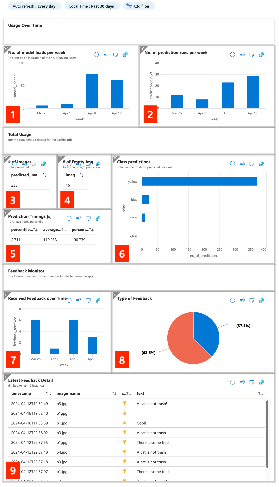

# Dashboard Query Documentation

This document contains the code for all plots shown in the dashboard in the [README file](../README.md). In the image
below, you can see the dashboard in full. The white number on the red background helps you find the query that was used
to generate the plot in the list below.



## 1

```
traces
| where message contains "model loaded"
| summarize model_loaded = count() by week=bin(timestamp, 7d)
| sort by week desc
```

## 2

```
traces
| where message contains "Prediction made"
| summarize prediction_run_ct = count() by week=bin(timestamp, 7d)
| sort by week desc
```

## 3

```
traces
| where message contains "Prediction made"
| summarize predicted_images=sum(todecimal(customDimensions.no_of_images))
```

## 4

```
traces
| where message contains "Prediction made"
| summarize images_without_predictions=sum(todecimal(customDimensions.no_of_images_wo_predictions))
```

## 5

```
traces
| where message contains "Prediction made"
| summarize percentile10_duration=percentile(todecimal(customDimensions.duration), 10), average_duration=avg(todecimal(customDimensions.duration)), percentile90_duration=percentile(todecimal(customDimensions.duration), 90)
```

## 6

```
traces
| where message contains "Prediction made"
| extend color = "yellow", value = todecimal(customDimensions.yellow)
| summarize sum(value) by color
| union (
    traces
    | where message contains "Prediction made"
    | extend color = "blue", value = todecimal(customDimensions.blue)
    | summarize sum(value) by color
), (
    traces
    | where message contains "Prediction made"
    | extend color = "glass", value = todecimal(customDimensions.glass)
    | summarize sum(value) by color
), (
    traces
    | where message contains "Prediction made"
    | extend color = "other", value = todecimal(customDimensions.other)
    | summarize sum(value) by color
)
| order by sum_value desc 
| project-rename no_of_predictions = sum_value
```

## 7

```
traces
| where message contains "feedback received"
| summarize feedback_received = count() by week=bin(timestamp, 7d)
| sort by week desc
```

## 8

```
traces
| where message contains "feedback received"
| summarize n=count() by tostring(customDimensions.score)
```

## 9

```
traces
| where message contains "feedback received"
| project-keep customDimensions, timestamp
| evaluate bag_unpack(customDimensions, ignoredProperties=dynamic(['fileName', 'level', 'lineNumber', 'module', 'process', 'reason', 'type']))
| sort by timestamp desc
| limit 10
```